# 16-Bit Pipelined CPU Implementation

This repository contains the design, implementation, and verification of a custom 16-bit MIPS-like pipelined processor. Built and simulated in Logisim Evolution, the processor features a 5-stage pipeline, hardware-level hazard resolution (data forwarding and pipeline stalling), and support for R-type, I-type, and J-type instruction formats.

---

## How to Run the Simulation

1. Install [Logisim Evolution](https://github.com/logisim-evolution/logisim-evolution) (version 4.0.0 or later).*
2. Open the circuit file `16-bit-pipelined-processor.circ`.
3. Select the Instruction Memory RAM component in the `IF` stage.
4. Right-click the RAM component, select **Load Image**, and choose the `array-sum-test` file located in the project's root folder.
5. Reset the simulation: **Simulate > Reset Simulation** (or `Ctrl+R`).
6. Enable automatic clock ticks: **Simulate > Auto-Tick Enabled** (or `Ctrl+K`). You can adjust the tick frequency (e.g., to 4 Hz or higher) under **Simulate > Tick Frequency**.
7. Observe execution and inspect register states in the Register File subcircuit once the program reaches the infinite loop.

\* A Java Runtime Environment (JRE) or Java Development Kit (JDK) (version 16 or later) must be installed on your system to run Logisim Evolution.

---

## Technical Specifications

- **Data Width**: 16-bit
- **Address Space**: 12-bit word-addressable instruction and data memories (supporting up to 4096 words of 16 bits each)
- **Register File**: 8 registers (R0 to R7). R0 is hardwired to zero. R1 and R7 are used for hardcoded destinations in specific instructions (LUI and JAL).
- **Pipeline Stages**: 5-stage design:
  1. **IF (Instruction Fetch)**: Fetches the 16-bit instruction from memory and updates the PC.
  2. **ID (Instruction Decode / Register Read)**: Decodes the opcode/funct, reads operands from the register file, and resolves branch/jump targets.
  3. **EX (Execute)**: Performs ALU operations, selects operands, and resolves destination registers.
  4. **MEM (Memory Access)**: Reads or writes data memory for load and store instructions.
  5. **WB (Write Back)**: Writes results back to the register file.

---

## Instruction Set Architecture (ISA)

The processor implements a MIPS-like instruction set with three distinct instruction formats:

### Instruction Formats

#### 1. R-type Format
Used for register-to-register operations. It includes a 4-bit Opcode, three 3-bit register numbers (Rs, Rt, Rd), and a 3-bit function field (funct).

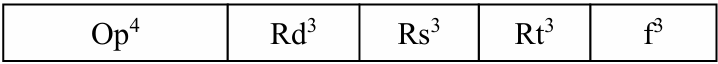

#### 2. I-type Format
Used for immediate arithmetic, memory operations, and conditional branches. It includes a 4-bit Opcode, two 3-bit registers (Rs, Rt), and a 6-bit signed immediate constant.

#### 3. J-type Format
Used for unconditional jumps and loading upper immediates. It includes a 4-bit Opcode and a 12-bit immediate constant.

---

### Instruction Set Summary
Below is the complete set of instructions supported by the processor's ISA:

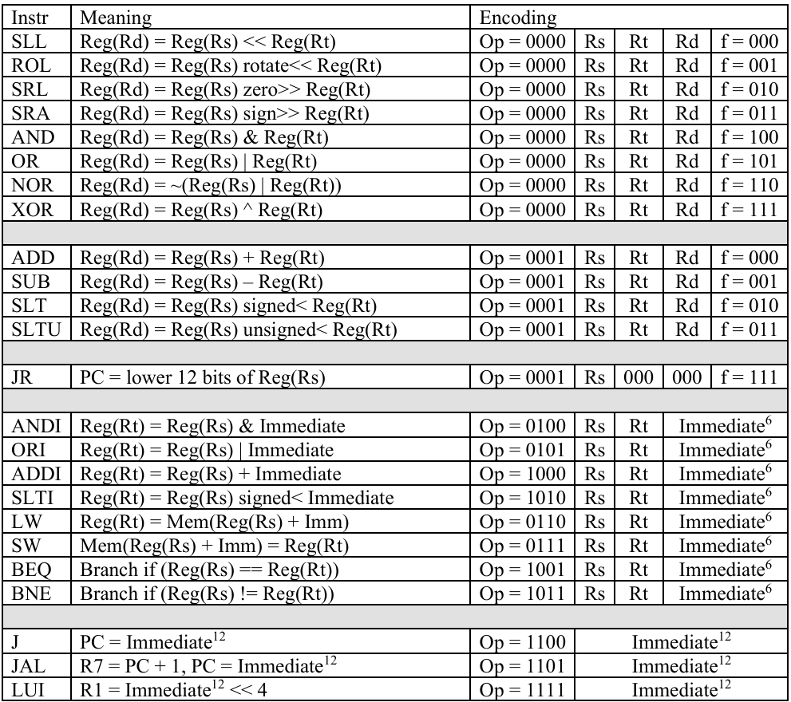

---

## Datapath and Hardware Modules

The processor is implemented as a 5-stage pipelined datapath, structured hierarchically using custom Logisim subcircuits.

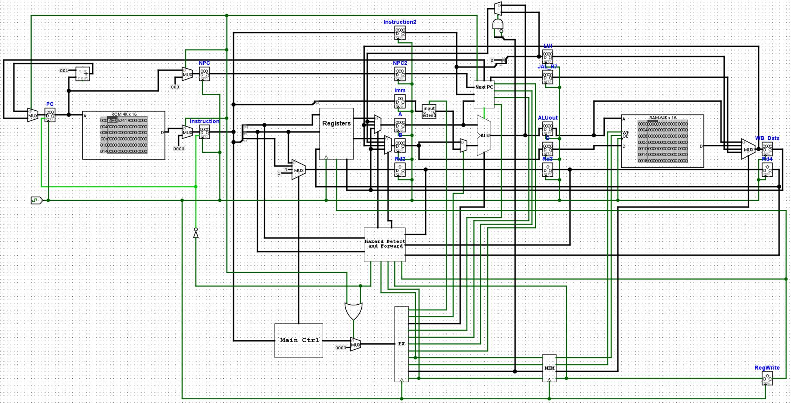
*Figure 1: Full schematic diagram of the 5-stage pipelined datapath implemented in Logisim.*

### Key Hardware Subcircuits

#### 1. Arithmetic Logic Unit (ALU)
The 16-bit ALU supports twelve core operations selected by a 4-bit ALU control signal: addition (**ADD**), subtraction (**SUB**), bitwise logical operations (**AND**, **OR**, **NOR**, **XOR**), logical/arithmetic shifts (**SLL**, **SRL**, **SRA**), circular rotation (**ROL**), and comparison operations (**SLT**, **SLTU**).
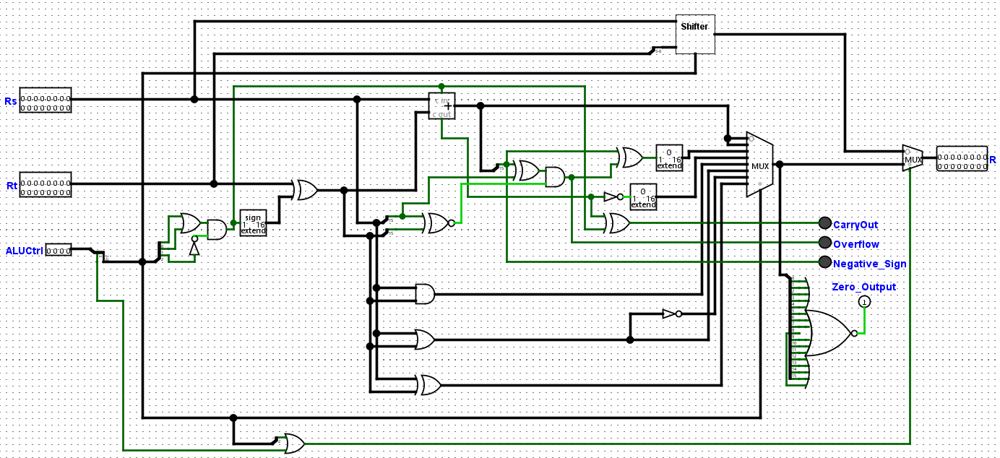
*Figure 2: 16-bit ALU subcircuit schematic supporting arithmetic, logic, comparison, and shift operations.*

#### 2. Barrel Shifter
Handles logical shifts (SLL, SRL), arithmetic shift right (SRA), and circular left rotation (ROL) using the lower 4 bits of the Rt register as the shift/rotate amount. Note that a circular right rotation by n bits is accomplished by executing a circular left rotation by 16 - n bits.
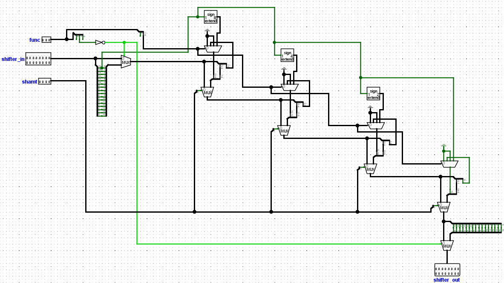
*Figure 3: 16-bit Barrel Shifter implementation supporting multi-bit shifts and rotations.*

#### 3. Register File
Contains eight 16-bit registers (R0-R7), with R0 hardwired to zero. It supports two asynchronous read ports for parallel operand fetching and one synchronous write port that updates on the rising clock edge.
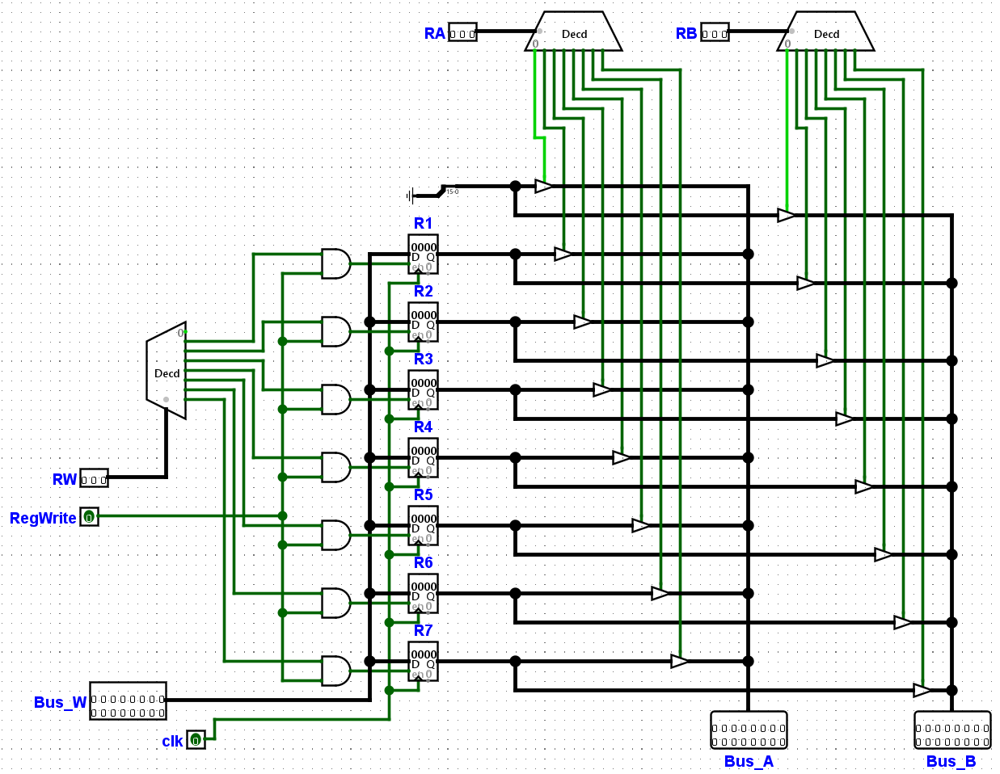
*Figure 4: 8-register Register File design with asynchronous read ports and a synchronous write port.*

#### 4. Program Counter & Next PC Logic
Controls the program flow by selecting the next address among: sequential instruction (PC + 1), branch targets (PC + SignExtImm), jump targets (Imm12), and register-indirect targets (Rs[11:0] for JR).
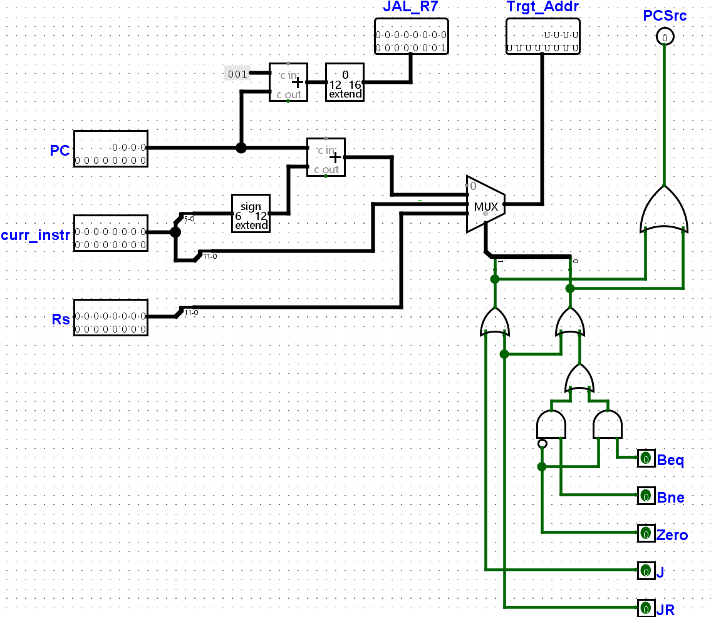
*Figure 5: Next PC selection logic supporting sequential execution, branches, jumps, and register-indirect jumps.*

#### 5. Hazard Detection & Forwarding Logic Circuit
Integrates the combinational control blocks that compare source and destination registers across pipeline stages to trigger data forwarding or NOP bubbles.
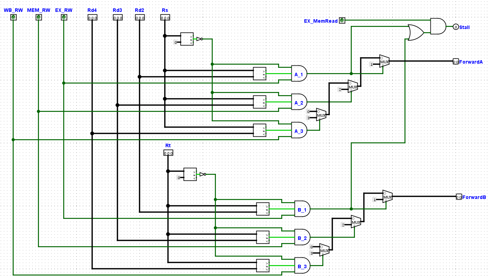
*Figure 6: Hazard Detection and Forwarding Unit implementation for pipeline hazard resolution.*

---

## Control Unit Design

The Control Unit translates opcodes and function fields into the execution control signals that orchestrate the datapath components.

#### Control Signals Truth Table
This table shows the control signal outputs generated by the Control Unit for each instruction opcode:

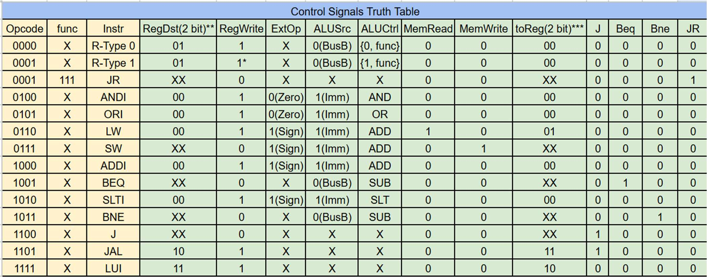
*Figure 7: Truth table showing control signals generated for each instruction.*

> **Note:** X = don't care. For R-Type 1 (opcode 0001), RegWrite = 1* means it is gated off when the funct field is 111 (JR instruction) using the JR flag. RegDst and toReg are 2-bit multiplexer selectors.

#### Control Signals Encoding
The control signals are encoded as follows to select the proper hardware routing:

- **RegDst** (2-bit) selects the destination register to write:
  - `00` -> Rt (I-type destination register)
  - `01` -> Rd (R-type destination register)
  - `10` -> R7 hardcoded (JAL link register)
  - `11` -> R1 hardcoded (LUI target register)
- **toReg** (2-bit) selects the data source for the write-back stage:
  - `00` -> ALU output
  - `01` -> Memory read data output (LW)
  - `10` -> LUI immediate shifted result (Imm12 << 4)
  - `11` -> JAL return address (PC + 1)
- **ALUCtrl** (4-bit) selects the active operation inside the ALU:
  - `0000` -> SLL (Shift Left Logical)
  - `0001` -> ROL (Rotate Left)
  - `0010` -> SRL (Shift Right Logical)
  - `0011` -> SRA (Shift Right Arithmetic)
  - `0100` -> AND
  - `0101` -> OR
  - `0110` -> NOR
  - `0111` -> XOR
  - `1000` -> ADD
  - `1001` -> SUB
  - `1010` -> SLT (Set Less Than, Signed)
  - `1011` -> SLTU (Set Less Than, Unsigned)

#### Boolean Equations for Control Signals
Using Karnaugh maps, I derived the simplified logic equations for each control signal. The 4-bit opcode `op[3:0]` is represented as variables `A, B, C, D` (where `A` is the MSB):

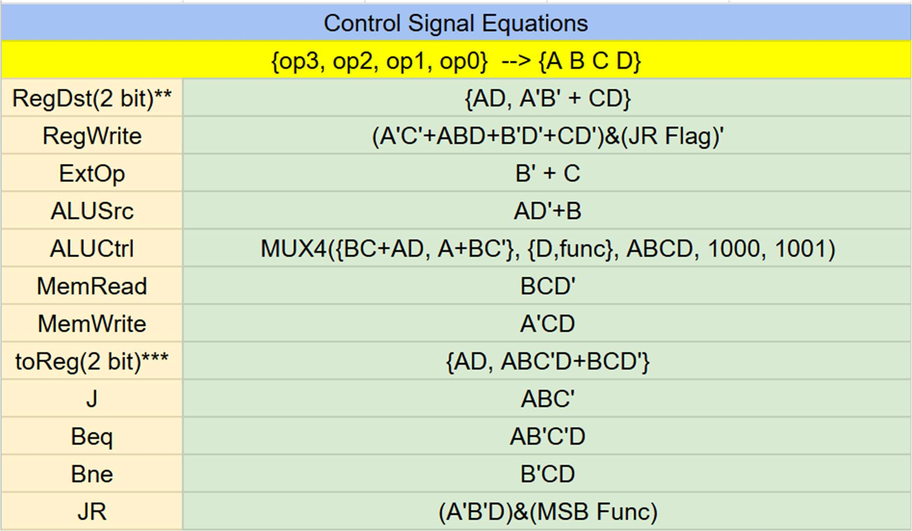
*Figure 8: Minimized boolean logic equations for the combinational control signals.*

> **Note:** RegWrite for JR must be forced to 0. This is achieved by ANDing the decoded RegWrite signal with NOT(JR). The JR flag is asserted when opcode = 0001 and funct = 111.

#### Control Unit Circuit Schematic
Below is the gate-level combinational circuit diagram of the Main Control Unit implemented in Logisim:

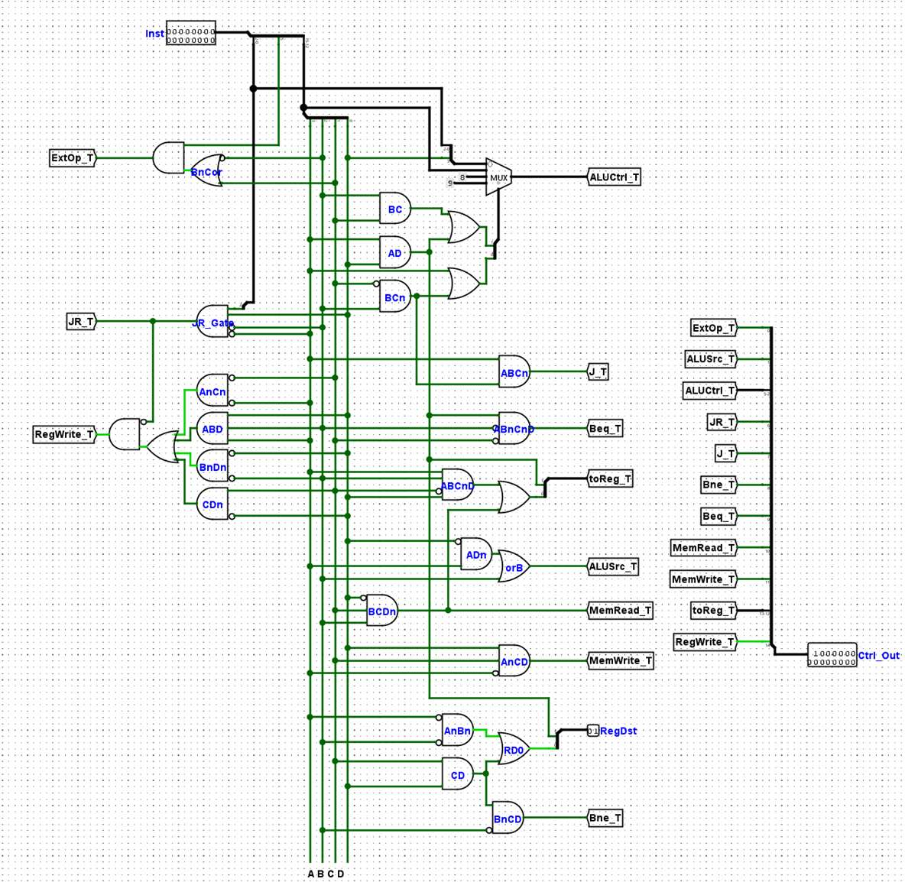
*Figure 9: Combinational logic schematic of the Control Unit implemented in Logisim.*

---

## Hazard Handling

Data and control hazards are resolved entirely in hardware, maintaining architectural correctness without compiler-inserted NOPs.

### 1. Data Hazards (ALU Forwarding)
The Forwarding Unit monitors instructions in the `EX/MEM` and `MEM/WB` stages. If a downstream stage writes to a register that the current `EX` stage uses as a source (`Rs` or `Rt`), the forwarding unit routes the computed value directly to the ALU inputs, avoiding a stall.
- **EX Hazard**: Forwards from `EX/MEM` pipeline registers.
- **MEM Hazard**: Forwards from `MEM/WB` pipeline registers.

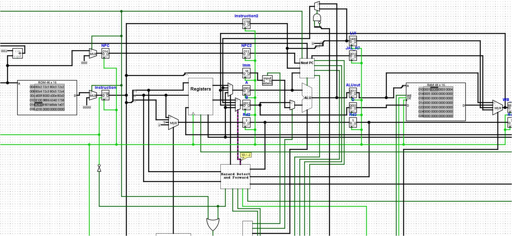
*Figure 10: Logisim execution state illustrating real-time data forwarding from EX/MEM to the ALU inputs.*

### 2. Load-Use Hazards (1-Cycle Stall)
When a Load Word (`LW`) instruction is immediately followed by a dependent instruction that uses the loaded value, forwarding is impossible because the data is only available at the end of the `MEM` stage. The Hazard Detection Unit detects this case and:
- Installs a **NOP bubble** (zeroes out control signals) into the `ID/EX` register.
- Freezes the Program Counter (`PCWrite = 0`) and `IF/ID` register (`IF/IDWrite = 0`) for one clock cycle.

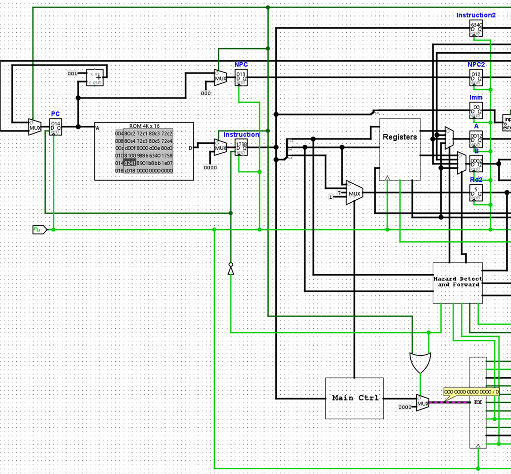
*Figure 11: Logisim execution state showing a NOP bubble insertion and pipeline freeze during a load-use hazard.*

### 3. Control Hazards (Branch & Jump Penalty)
Branches (BEQ, BNE) and jumps (J, JAL, JR) are resolved in the **ID stage** to minimize the branch penalty.
- A taken branch or unconditional jump inserts a **single NOP bubble** (1-cycle penalty) in the following clock cycle.
- An untaken branch incurs **zero penalty** cycles.

---

## Verification & Testing

I verified the processor's correctness through instruction-level unit testing and full program execution.

### 1. Instruction-Level Verification
Each instruction was tested independently to verify correct execution and register/memory updates:

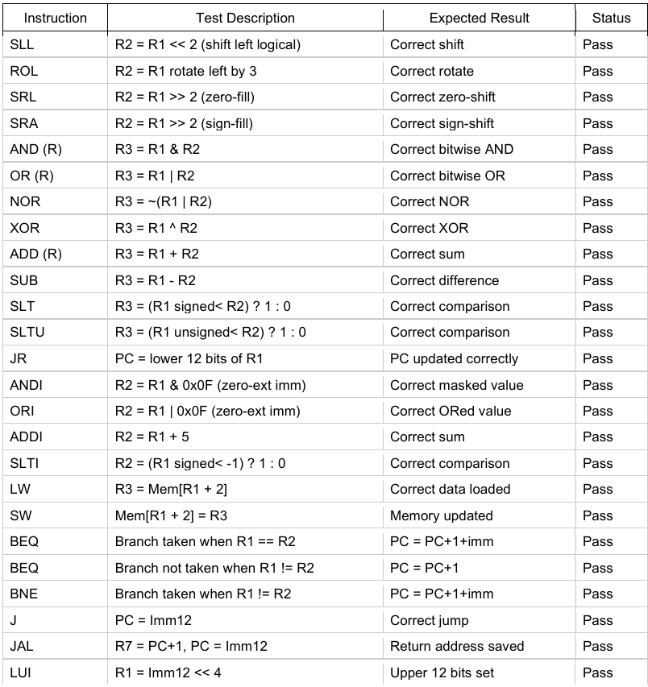
*Figure 12: Simulation results verifying the correct execution of each ISA instruction.*

### 2. Array Sum Program
I verified the complete pipelined datapath, forwarding, and stalling mechanisms by running a custom program that computes the sum of a 5-element array.

#### Test Program Flow
1. **Main Procedure**:
   - Initializes R1 as the base address (`0x010`) and R2 as the element count (`5`).
   - Stores the values `[1, 2, 3, 4, 5]` into data memory at the base address using consecutive Store Word (`SW`) instructions.
   - Calls the `sum_proc` procedure using `JAL`.
   - Loops infinitely to terminate.
2. **Sum Procedure (`sum_proc`)**:
   - Accumulates the values in R3 by looping over the array.
   - Updates the index variable and pointer on each iteration.
   - Returns to the main procedure using `JR R7`.

#### Simulation Results
After running the program to completion, the Register File contents and datapath state were inspected:

- **Accumulator (R3)**: Contains `0x000F` (decimal 15), verifying correct loop execution, register updates, and memory writes/reads.
- **Loop Index (R4)**: Contains `5`.

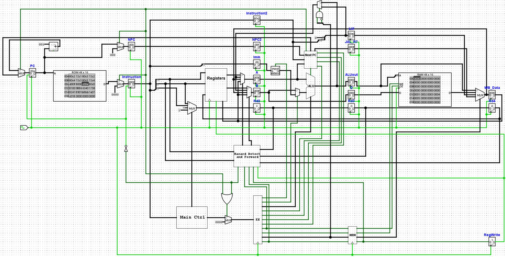
*Figure 13: Pipelined datapath state after running the array sum program to completion.*

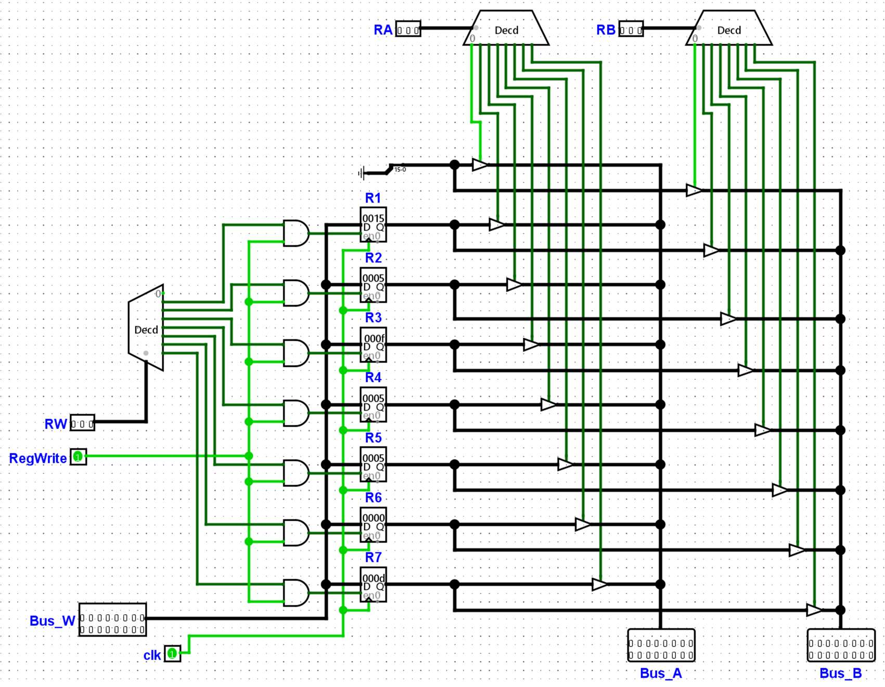
*Figure 14: Register file circuit showing the correct accumulated sum in R3.*
